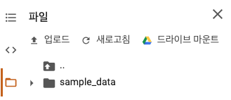

# Movie Text Analysis

네이버 영화 리뷰 데이터셋을 활영하여 영화 리뷰 텍스트의 긍정/부정 어조를 예측하는 모델입니다.
1. [네이버 영화 리뷰 데이터셋](#https://github.com/e9t/nsmc)을 사용하였습니다.
2. 한국어 NLP 지원 라이브러리 [KoNLPy](https://konlpy-ko.readthedocs.io/ko/v0.4.3/)를 사용해 전처리 작업 진행하였습니다.
3. Google Colabatory 및 Jupyter Notebook 환경에서 작동할 수 있도록 .ipynb 파일 업로드합니다.

## Settings
### 1. 드라이브 연결
##### [구글 코랩](https://colab.research.google.com/notebooks/intro.ipynb#recent=true)을 실행한 이후, 구글 계정과 연동합니다. 이후 아래 코드를 실행시켜 구글 드라이브에 마운트합니다.
~~~python
from google.colab import drive
drive.mount('/content/drive')
~~~
##### 좌측 네비게이션 뷰의 파일 > 드라이브로 복사 버튼을 클릭하여 자동생성된 코드를 활용해도 무방합니다.

### 2. 필요한 파이썬 모듈 설치
##### [데이터 디렉토리](#data)의 파일 5개를 전부 복사해 현재 작업 디렉토리에 붙여넣습니다. 현재 작업 디렉토리는 다음 명령어로 확인할 수 있습니다
~~~shell
pwd
~~~ 
##### pip 명령어를 활용해, KoNLPy 모듈과 폰트를 설치합니다.
~~~python
!pip install konlpy
!apt -qq -y install fonts-nanum
~~~

## How to Train Model
### 1. [Colab 지원 파일](#Movie_ML_practice_Console.ipynb)의 네 번째 코드를 실행합니다. 모델 학습 과정은 다음 부분으로 나눌 수 있습니다.
- 라이브러리 모듈 불러오기
~~~python
import json
import os
import nltk
import matplotlib.pyplot as plt
import numpy as np

from pprint import pprint
from konlpy.tag import Okt
from matplotlib import font_manager, rc

from keras.models import load_model
from tensorflow.keras import models
from tensorflow.keras import layers
from tensorflow.keras import optimizers
from tensorflow.keras import losses
from tensorflow.keras import metrics

%matplotlib inline
~~~
- 입력 파일 읽기 및 가공
~~~python
okt = Okt()
train_data = read_data('ratings_train.txt')
test_data = read_data('ratings_test.txt')

if os.path.isfile('train_docs.json'):
    with open('train_docs.json') as fileBuffer:
        train_docs = json.load(fileBuffer)
    with open('test_docs.json') as fileBuffer:
        test_docs = json.load(fileBuffer)
else:
    train_docs = [(tokenize(row[1]), row[2]) for row in train_data]
    test_docs = [(tokenize(row[1]), row[2]) for row in test_data]

    with open('train_docs.json', 'w', encoding="utf-8") as file:
        json.dump(train_docs, file, ensure_ascii=False, indent="\t")
    with open('test_docs.json', 'w', encoding="utf-8") as file:
        json.dump(test_docs, file, ensure_ascii=False, indent="\t")
~~~
- 데이터 전처리 : KoNLPy 라이브러리를 통해 input 데이터에 있는 단어를 빈출 단어 기준으로 정렬하여 벡터화 합니다.
~~~python
tokens = [token for data in train_docs for token in data[0]]
text = nltk.Text(tokens, name='NMSC')
showGraph(text)

# 빈출 단어로 정렬
selected_words = [f[0] for f in text.vocab().most_common(1000)]

# 훈련 및 검증 데이터셋 준비
train_x = [term_frequency(d) for d, _ in train_docs]
test_x = [term_frequency(d) for d, _ in test_docs]
train_y = [c for _, c in train_docs]
test_y = [c for _, c in test_docs]

# 훈련을 위해 데이터 타입 float32로 변환
x_train = np.asarray(train_x).astype('float32')
x_test = np.asarray(test_x).astype('float32')
y_train = np.asarray(train_y).astype('float32')
y_test = np.asarray(test_y).astype('float32')
~~~

- 모델 훈련
~~~python
model = models.Sequential()
model.add(layers.Dense(64, activation='relu', input_shape=(1000,)))
model.add(layers.Dense(64, activation='relu'))
model.add(layers.Dense(1, activation='sigmoid'))

model.compile(optimizer=optimizers.RMSprop(lr=0.001),
             loss=losses.binary_crossentropy,
             metrics=[metrics.binary_accuracy])

model.fit(x_train, y_train, epochs=10, batch_size=512)
results = model.evaluate(x_test, y_test)

json_string = model.to_json()
with open("movie-review-model.json", "w") as json_file:
  json_file.write(json_string)
print("Saved model for json format")

model.save_weights("model.h5")
print("Saved weight for .h5 format")
~~~

### 2. 데이터 검증
#### 주어진 텍스트가 긍정적인 의미의 영화 리뷰인지 검사하는 함수 : predict_positive_rate()
~~~python
def term_frequency(doc):
    return [doc.count(word) for word in selected_words]

def load_model():
  if os.path.isfile('train_docs.json'):
    json_file = open('movie-review-model.json', 'r')
    model_json = json_file.read()
    json_file.close()

    loaded_model = model_from_json(model_json)
    model.load_weights('model.h5')
    return model
  else:
    raise ValueError('there is no file')

def predict_postitive_rate(review):
  model = load_model()
  token = tokenize(review)
  tf = term_frequency(token)
  data = np.expand_dims(np.asarray(tf).astype('float32'), axis=0)
  
  score = float(model.predict(data))
  if(score > 0.5):        
    print("[{}]는 {:.2f}% 확률로 긍정적 리뷰입니다.\n".format(review, score * 100))
  else:        
    print("[{}]는 {:.2f}% 확률로 부정적 리뷰입니다.\n".format(review, (1 - score) * 100))
~~~

#### 실제 활용
~~~python
predict_postitive_rate("인생 최고의 영화!")
predict_postitive_rate("최고의 배우. 그러나 답답한 스토리 전개. 배우가 아깝다.")
~~~

 
# Reference
#### https://github.com/e9t/nsmc
#### https://cyc1am3n.github.io/2018/11/10/classifying_korean_movie_review.html

# Contribution
### All kind of contribution is welcomed. Please send me a pull request

# license

  

